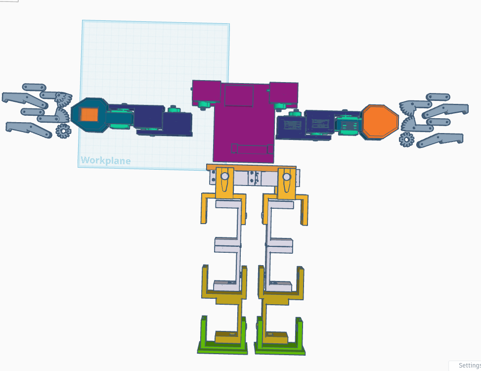

# Humanoide 3D

Este repositorio contiene modelos 3D diseñados para ensamblar un humanoide que funciona con servomotores.

## Requisitos
- Impresora 3D (FDM o SLA).
- Servomotores compatibles.
- Tornillos y elementos de fijación.

## Cómo Usar
1. Descarga los archivos STL desde este repositorio.
2. Imprime las piezas con la configuración recomendada.
3. Ensambla el humanoide siguiendo la guía proporcionada.
4. Instala los servomotores y realiza las conexiones necesarias.
